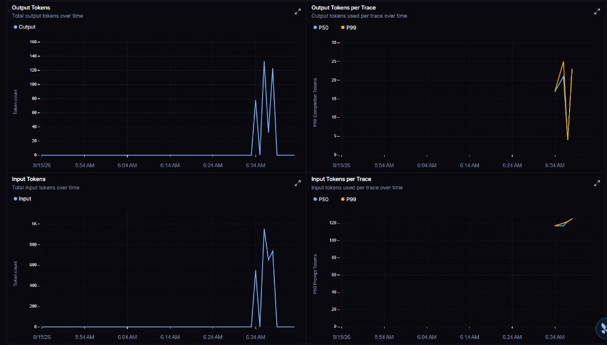
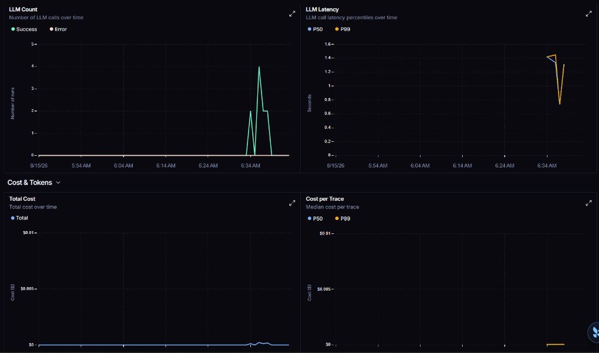

# Production PDF RAG Assistant

A production-style Retrieval-Augmented Generation (RAG) system that lets users upload one or more PDF files and chat with them using an OpenAI model.

It combines:
- FastAPI backend for ingestion and query APIs
- Streamlit frontend with a modern chat experience
- LangGraph to orchestrate query-time RAG (retrieve, grade, retry, generate)
- LangSmith to trace graph runs, tokens, latency, and cost
- Chroma persistent vector database for document memory
- Hybrid retrieval plus reranking for better answer quality

## What This Project Does

- Uploads and indexes PDF documents
- Splits documents into semantic chunks with metadata
- Stores embeddings in persistent Chroma DB
- Expands user queries with LLM rewriting (and likely typo fixes from document titles)
- Retrieves relevant chunks using:
  - Vector retrieval with MMR
  - Keyword retrieval with BM25
  - Vector and BM25 run in parallel
- Re-ranks retrieved chunks with a cross-encoder model
- LangGraph grades context, retries once if weak, or returns "I don't know"
- Traces each query in LangSmith (nodes, tokens, latency, cost)
- Generates grounded answers from context only
- Streams answer tokens in UI
- Shows sources (file and page)
- Supports multi-document querying with document filters

## Why It Is Useful

- Reduces hallucination by enforcing context-grounded answers
- Improves retrieval quality using hybrid search plus reranking
- Works with local persistent indexing across restarts
- Provides both API and UI for flexible usage

## System Architecture

### Architecture Diagram

```
┌─────────────────────────────────────────────────────────────────────────────┐
│                          PDF RAG ASSISTANT SYSTEM                           │
└─────────────────────────────────────────────────────────────────────────────┘

                            ┌─────────────────────┐
                            │   Streamlit UI      │
                            │   (app.py, ui.py)   │
                            │  - Chat Interface   │
                            │  - PDF Upload       │
                            │  - Source Display   │
                            └──────────┬──────────┘
                                       │
                                       │ HTTP
                                       ▼
                    ┌──────────────────────────────────────┐
                    │      FastAPI Backend (api.py)        │
                    │  ┌─────────────────────────────────┤ |
                    │  │ ▪ POST /upload (PDF ingestion)  │ |
                    │  │ ▪ POST /query (LangGraph RAG)   │ |
                    │  │ ▪ POST /query/stream            │ |
                    │  │ ▪ GET /documents (list docs)    │ |
                    │  │ ▪ GET /health (status check)    │ |
                    │  └─────────────────────────────────┤ |
                    └──┬───────────────────────────────────┘
                       │
        ┌──────────────┼──────────────┬──────────────┐
        │              │              │              │
        ▼              ▼              ▼              ▼
   ┌─────────┐  ┌──────────────┐  ┌──────────┐  ┌──────────┐
   │Ingestion│  │ LangGraph    │  │Reranker  │  │   LLM    │
   │(PDF→    │  │ RAG graph    │  │(Cross-   │  │(Answer   │
   │ Chunks) │  │ (query path) │  │encoder)  │  │Generate) │
   └────┬────┘  └──────┬───────┘  └────┬─────┘  └────┬─────┘
        │              │               │              │
        │     ┌────────┤               │              │
        │     │        │               │              │
        └─────┼────┬───┼───────────────┼──────────────┘
              │    │   │               │
              ▼    ▼   ▼               ▼
        ┌──────────────────────────────────────────────┐
        │        Embedding Models & LLM Services       │
        │  ┌──────────────────────────────────────────┤|
        │  │ • OpenAI Embeddings (text-embedding-3...)|│
        │  │ • OpenAI Chat Model (gpt-4o-mini)        │|
        │  │ • BM25 Keyword Retrieval                 |│
        │  │ • HuggingFace Reranker                   |│
        │  └──────────────────────────────────────────┤|
        └──────────┬───────────────────────────────────┘
                   │
        ┌──────────┴──────────┐
        │                     │
        ▼                     ▼
   ┌──────────────┐   ┌─────────────────┐
   │ Chroma DB    │   │  OpenAI API     │
   │(Vector Store)│   │  (External LLM) │
   │  - Index     │   │  - Embeddings   │
   │  - Persist   │   │  - Chat Model   │
   └──────────────┘   └─────────────────┘
```

### Architecture Components Explained

#### **1. Streamlit Frontend (UI Layer)**
- **Files**: `app.py`, `ui.py`
- **Purpose**: Provides an interactive chat interface for end users
- **Features**:
  - Real-time PDF document upload with progress tracking
  - Persistent chat history within session
  - Document filtering for targeted queries
  - Source attribution (file name + page number)
  - Token streaming for responsive answers
- **How it works**: Communicates with FastAPI backend via HTTP requests, displays LLM responses in real-time

#### **2. FastAPI Backend (API Layer)**
- **File**: `api.py`
- **Purpose**: HTTP shell. Upload stays a one-shot job. `/query` and `/query/stream` invoke the LangGraph RAG app.
- **Key Endpoints**:
  - `GET /`: Small pointer to `/docs` and `/health`
  - `POST /upload`: Accepts PDF files and triggers ingestion pipeline
  - `POST /query`: Runs the graph and returns a generated answer
  - `POST /query/stream`: Runs the graph, then streams generate tokens
  - `GET /documents`: Lists all indexed documents in Chroma DB
  - `GET /health`: System health check (`openai_key_set`)
- **Responsibilities**:
  - CORS configuration for frontend access
  - Request validation using Pydantic schemas
  - Loads `OPENAI_API_KEY` from env, `.env`, or `.streamlit/secrets.toml`
  - Error handling and logging

#### **3. Document Ingestion Pipeline**
- **File**: `ingestion.py`
- **Process Flow**:
  1. **Load**: Extract text from PDF using PyPDFLoader
  2. **Chunk**: Split documents using RecursiveCharacterTextSplitter
     - Configurable chunk size (default: 800 chars)
     - Overlap for context preservation (default: 100 chars)
  3. **Embed**: Generate embeddings using OpenAI's text-embedding-3-small
  4. **Store**: Persist embeddings and metadata in Chroma DB
  5. **Deduplicate**: Skip re-ingestion of already processed documents using SHA256 hash
- **Output**: Indexed document chunks with metadata (source, page, content)

#### **4. LangGraph Query Orchestration**
- **Files**: `graph/state.py`, `graph/nodes.py`, `graph/rag_graph.py`
- **Purpose**: Control flow for questions only (not upload)
- **Graph**:
  1. `expand_query` — LLM rewrites plus likely typo fixes from PDF titles
  2. `hybrid_retrieve` — vector MMR and BM25 in parallel, then merge
  3. `rerank` — cross-encoder top-n
  4. `grade_context` — use rerank scores (no extra judge model)
  5. Branch:
     - Strong context → `generate`
     - Weak + first try → `rewrite_query` → retrieve again (max 1 retry)
     - Still weak → `refuse_no_context` (`I don't know.`, skip GPT)
- **LangChain** still does PDF load, split, embeddings, Chroma, and the chat model. LangGraph only decides the next step.

#### **5. Retrieval System (Hybrid Search)**
- **File**: `retriever.py`
- **Retrieval Strategy**:
  1. **Query Expansion**: LLM generates rewrites; can correct typos using document titles
  2. **Hybrid Retrieval** (vector and BM25 overlap):
     - **Vector Search**: MMR with k=8, fetch_k=25 (run in a thread pool)
     - **Keyword Search**: BM25 with k=8 on a shared corpus loaded once
     - **Fusion**: Merge and dedupe by `chunk_id`
  3. **Document Filtering**: Optional filter by source documents
- **Why Hybrid?**: Vector search excels at semantic matching, BM25 at exact terms. Combined = best of both worlds

#### **6. Reranking Module**
- **File**: `reranker.py`
- **Purpose**: Re-rank retrieved chunks by relevance to create higher-quality context
- **Model**: Cross-encoder (`cross-encoder/ms-marco-MiniLM-L-6-v2`)
  - Scores `(question, chunk)` pairs
  - Selects top-4 chunks (configurable)
- **Benefit**: Filters low-relevance results before the LLM; grade also uses these scores

#### **7. LLM & Answer Generation**
- **File**: `llm.py`
- **Components**:
  - **Chat Model**: OpenAI's gpt-4o-mini (configurable)
  - **System Prompt**: Context-only answers; allows obvious typos if context matches (e.g. paring → parsing)
  - **Anti-Hallucination**: Returns "I don't know" if context is insufficient
  - **Streaming**: Token-by-token generation for `/query/stream`
- **Process**:
  1. Format retrieved chunks as context
  2. Prefer a corrected expanded query when answering
  3. Generate or stream the answer
  4. Attach file + page sources

#### **8. Vector Store (Chroma DB)**
- **Location**: `./chroma_db/` (persistent on disk)
- **Purpose**: Centralized storage for:
  - Document embeddings (vector representations)
  - Document chunks (raw text)
  - Metadata (file names, page numbers, hash IDs)
- **Benefits**:
  - Persistent storage survives application restarts
  - Fast similarity search using vector indices
  - Collection-based organization

#### **9. Configuration Manager**
- **File**: `config.py`
- **Purpose**: Centralized settings management via environment variables
- **Key Settings**:
  - API credentials (OpenAI key, model names)
  - Search parameters (chunk size, k values, rerank threshold)
  - Upload limits (max file size, query length)
  - Service endpoints (host, port, base URL)

### Data Flow Through the System

```
User Input (PDF)
       │
       ▼
┌──────────────┐
│   Upload     │ → FastAPI /upload endpoint
│   Endpoint   │
└──────┬───────┘
       │
       ▼
┌──────────────────────────┐
│  Ingestion Pipeline      │
│  • Load PDF              │
│  • Split into chunks     │
│  • Generate embeddings   │
│  • Store in Chroma       │
└──────┬───────────────────┘
       │
       ▼
Chroma Vector DB (indexed & persistent)
       │
       │
User Query
       │
       ▼
┌──────────────────────────────────┐
│  LangGraph RAG (api.py invoke)   │
│  • Expand query (+ typo fixes)   │
│  • Hybrid search in parallel     │
│    - Vector MMR (thread pool)    │
│    - Keyword BM25 (shared index) │
│  • Merge / dedupe                │
│  • Cross-encoder rerank          │
│  • Grade scores                  │
│      ├─ strong → generate        │
│      ├─ weak, retry 0 → rewrite  │
│      └─ still weak → I don't know│
└──────┬───────────────────────────┘
       │
       ▼
Streamlit UI (displays answer + sources)
```

### Technology Stack

| Layer | Technology | Purpose |
|-------|-----------|---------|
| **Frontend** | Streamlit | Interactive chat UI |
| **Backend** | FastAPI | REST API & upload |
| **Query orchestration** | LangGraph | Expand → retrieve → rerank → grade → generate / retry / refuse |
| **Observability** | LangSmith | Traces, token usage, latency, and cost |
| **Vector DB** | Chroma | Document embeddings & storage |
| **Embeddings** | OpenAI (text-embedding-3-small) | Semantic representation |
| **LLM** | OpenAI (gpt-4o-mini) | Expansion, rewrite, answers |
| **Reranking** | HuggingFace Cross-encoder (MiniLM-L-6-v2) | Relevance scoring |
| **Keyword Search** | BM25 (rank-bm25) | Exact term matching (parallel with vector) |
| **PDF Processing** | PyPDF | Document extraction |
| **Validation** | Pydantic | Schema validation |

### Key Design Principles

1. **Modularity**: Ingestion, retrieval, reranking, and generation stay separate; LangGraph only wires the query path
2. **Hybrid Retrieval**: Semantic + keyword search, run in parallel
3. **Anti-Hallucination**: Context-only answers; weak retrieval can skip the LLM
4. **Persistence**: Chroma DB stores embeddings permanently, avoiding re-processing
5. **Streaming**: Token streaming provides real-time user feedback
6. **Configurability**: All parameters are environment-driven for easy deployment flexibility

## Project Structure

- app.py: Streamlit launcher (file watcher disabled)
- ui.py: Streamlit chat UI
- api.py: FastAPI server; `/query` invokes LangGraph
- graph/: RAG state, nodes, and compiled graph
- docs/langsmith/: LangSmith dashboard screenshots
- config.py: central settings (including LangSmith env export)
- schemas.py: request and response schemas
- ingestion.py: PDF load, chunk, metadata, dedup
- retriever.py: query expansion plus parallel hybrid retrieval
- reranker.py: cross-encoder reranking
- llm.py: strict prompting and streaming generation

## Features

- LangGraph query flow with one rewrite retry and refuse-on-weak-context
- LangSmith tracing for graph runs (tokens, LLM count, latency, cost)
- MMR retriever with configurable k and fetch_k
- LLM query expansion (multiple rewrites, typo-aware)
- Hybrid retrieval (vector plus BM25 in parallel)
- Cross-encoder reranking for top chunks
- Strict anti-hallucination prompt with fallback: I don't know
- Token streaming in UI
- Conversation memory in session
- File-size and query-length validation
- Structured logging and error handling
- Source display with file and page metadata

## Requirements

- Python 3.10 or newer
- OpenAI API key
- Optional: LangSmith API key (service key `lsv2_sk_`) for traces
- Windows, Linux, or macOS

## Clone and Run

1. Clone the repository

```bash
git clone https://github.com/Maneeshaherath/pdf_rag_assitant
cd your-repo-name
```

2. Create and activate virtual environment

Windows CMD:

```bash
python -m venv venv
venv\Scripts\activate
```

PowerShell:

```bash
python -m venv venv
.\venv\Scripts\Activate.ps1
```

3. Install dependencies

```bash
pip install -r requirements.txt
```

4. Configure API key

Option A: `.env` file in the project root (works for both API and UI)

```
OPENAI_API_KEY=YOUR_NEW_KEY
```

Copy from `.env.example`. Do not use spaces around `=`.

Option B: PowerShell (this session only; restart uvicorn after)

```powershell
$env:OPENAI_API_KEY="YOUR_NEW_KEY"
```

Windows CMD:

```bat
set OPENAI_API_KEY=YOUR_NEW_KEY
```

Do not run `OPENAI_API_KEY = "..."` in PowerShell — that is not valid.

Option C: Streamlit secrets (also loaded by the FastAPI backend)

Create `.streamlit/secrets.toml` with:

```toml
OPENAI_API_KEY = "YOUR_NEW_KEY"
```

LangSmith (optional traces of the RAG graph):

```
LANGSMITH_TRACING=true
LANGSMITH_API_KEY=lsv2_your_real_key
LANGSMITH_PROJECT=pdf-rag
```

Replace `<your-api-key>` with a **service** key (`lsv2_sk_...`) from https://smith.langchain.com. Personal tokens (`lsv2_pt_`) often return 403. Restart uvicorn. Check `GET /health` — `langsmith_tracing` and `langsmith_key_set` must be `true`. Traces appear under `LANGSMITH_PROJECT`.

5. Start backend

```bash
uvicorn api:app --host 127.0.0.1 --port 8000 --reload
```

6. Start frontend in another terminal

```bash
streamlit run app.py
```

7. Open the UI

- Streamlit usually runs at http://localhost:8501
- Upload PDFs from sidebar
- Ask questions in the chat box at bottom

## LangSmith observability

Each `/query` and `/query/stream` run is sent to LangSmith as `pdf-rag-query`. You can inspect expand → retrieve → rerank → grade → generate (or rewrite / refuse), plus OpenAI calls.

Setup is `.env` only (see Clone and Run). The API copies `LANGSMITH_*` into the process environment so LangChain tracers can see them.

### Proof: live dashboard

After a successful query, LangSmith shows token usage, LLM count, latency, and cost:

<table>
  <tr>
    <td align="center" width="50%">
      
      <br />Token usage
    </td>
    <td align="center" width="50%">
      
      <br />LLM count, latency, and cost
    </td>
  </tr>
</table>

These screenshots are from this project after tracing was enabled (15 Aug 2026).

## API Endpoints

- GET /
- GET /health
- GET /documents
- POST /upload
- POST /query
- POST /query/stream

## Configuration

All main settings are centralized in `config.py`, including:

- model names
- chunk size and overlap
- retrieval and reranking limits (`RERANK_TOP_N`, `RERANK_MIN_SCORE`)
- LangGraph retry cap (`RAG_MAX_RETRIES`, default 1)
- LangSmith tracing (`LANGSMITH_TRACING`, `LANGSMITH_API_KEY`, `LANGSMITH_PROJECT`)
- max query length and max upload size
- API host and port
- Chroma path

## Security Notes

- Never commit API keys to git
- Keep `.streamlit/secrets.toml` in .gitignore
- Rotate keys immediately if exposed
- Prefer environment variables or secret managers in deployment

## Common Troubleshooting

1. 401 Unauthorized from OpenAI, or `OPENAI_API_KEY is missing`
- PowerShell must use `$env:OPENAI_API_KEY="..."`, then restart uvicorn
- Or put the key in `.env` / `.streamlit/secrets.toml` and restart
- Do not recreate `venv` while it is activated (`Permission denied` on `python.exe`)

2. `GET /` returns 404
- Use http://127.0.0.1:8000/docs or `/health`. `GET /json/version` is the browser DevTools, ignore it.

3. Streamlit `No module named 'torchvision'`
- Harmless leftover from Streamlit scanning `transformers`. Disabled in `.streamlit/config.toml` (`fileWatcherType = "none"`). Restart Streamlit after pulling this change.

4. Long first response time
- First reranker load downloads model weights once
- Later queries are much faster due to cache

5. Empty document filter
- Ensure upload succeeded
- Check GET /documents endpoint

6. LangSmith `403 Forbidden` on `/runs/multipart`
- Tracing is on; LangSmith rejected the key. `lsv2_pt_` personal tokens often cannot ingest traces.
- Create a **service API key** (`lsv2_sk_`) under LangSmith → Settings → API Keys
- If the UI is EU, set `LANGSMITH_ENDPOINT=https://eu.api.smith.langchain.com`
- Optionally set `LANGSMITH_WORKSPACE_ID` from workspace settings
- Restart uvicorn after changing `.env`

## Deployment Notes

For production deployment:

- Run FastAPI behind a reverse proxy
- Use managed secrets
- Add authentication and rate limiting
- Add monitoring and structured logs
- Pin dependency versions for reproducibility

## License

This project is licensed under the MIT License. See the LICENSE file for details.
