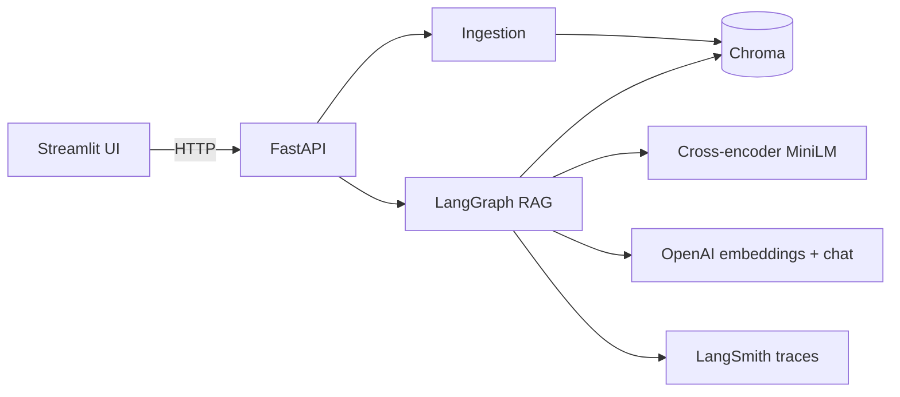
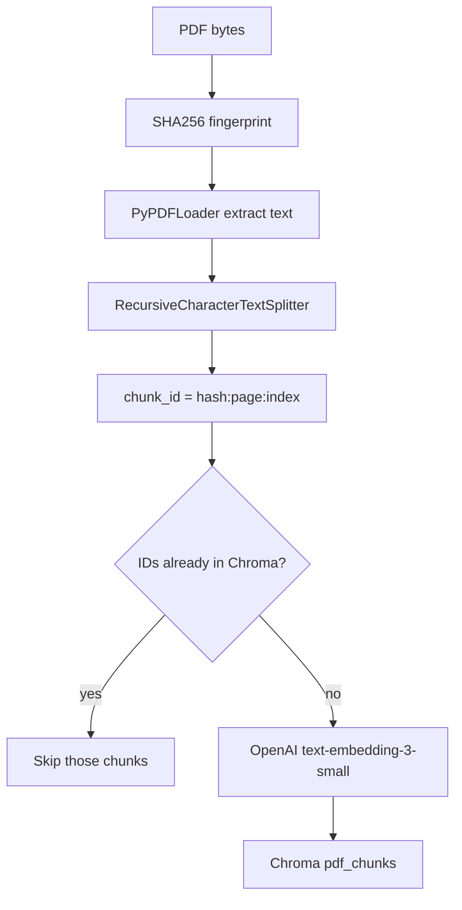
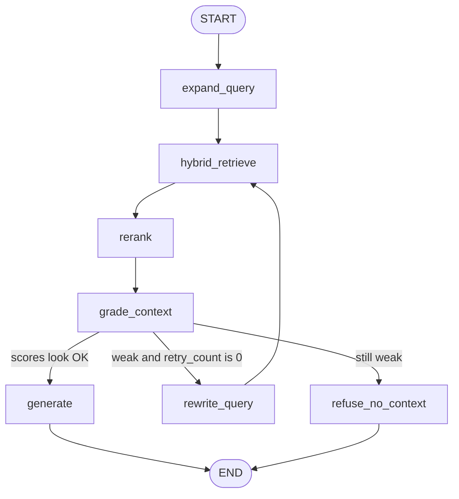
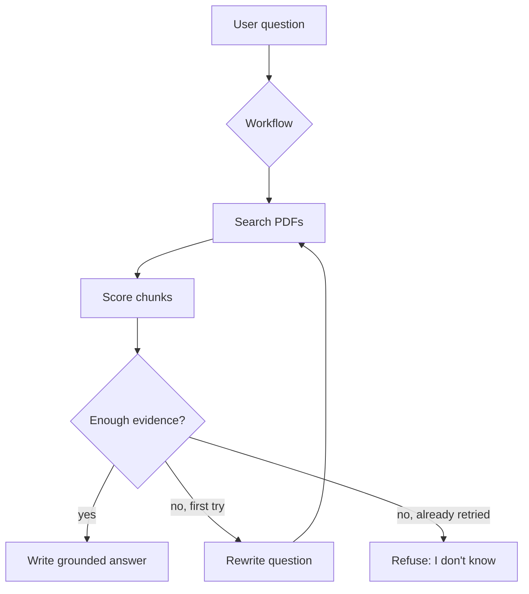
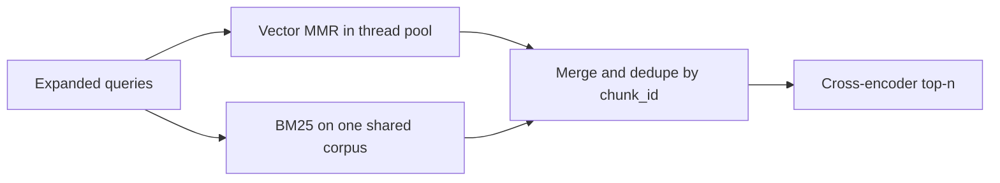

# Technical documentation

This note describes how the PDF RAG assistant is built, why the pieces were chosen, and what we deliberately did not use.

For clone-and-run steps, see the [README](../README.md).

---

## 1. What this project is

Users upload PDFs and ask questions. The system finds relevant passages and answers **only from those passages**. If the PDFs do not contain enough information, it says **I don't know**.

There are two jobs:

1. **Index** — turn PDFs into searchable chunks (upload path).
2. **Answer** — retrieve, rerank, and generate (query path).

Indexing is a straight pipeline. Answering is a **LangGraph** with a few branches (retry once, or refuse). It is not a free-roaming agent with tools.

---

## 2. Architecture

| Layer | Role |
|--------|------|
| Streamlit (`app.py`, `ui.py`) | Chat, upload, sources. Chat history lives only in the browser session. |
| FastAPI (`api.py`) | HTTP API. Upload stays here. `/query` and `/query/stream` call the graph. |
| Ingestion (`ingestion.py`) | PDF → text → chunks → embeddings → Chroma. |
| LangGraph (`graph/`) | Query control flow. |
| Retriever / reranker / LLM | The actual search and answer steps. |
| Chroma | Persistent chunk + embedding store. Not a chat database. |
| LangSmith | Optional traces (tokens, latency, which graph branch ran). |

Upload never goes through LangGraph. A one-shot ingest job does not need a state machine.

---

## 3. Data pipeline (indexing)

**Chunking.** Default chunk size is **800 characters**, overlap **100**. Overlap repeats the end of one chunk at the start of the next so a sentence sitting on a split is not lost.

**IDs.** Each chunk gets a stable id: `{doc_hash}:{page}:{index}`. Same file bytes → same hash → same ids → re-upload does not duplicate.

**No OCR.** `PyPDFLoader` only reads a text layer. Scanned image PDFs will index poorly.

**Metadata stored with each chunk:** `file_name`, `doc_hash`, `source`, `page`, `chunk_id`.

---

## 4. Query / LangGraph diagram

This is the real control flow in `graph/rag_graph.py`.

| Node | What it does |
|------|----------------|
| `expand_query` | Original question plus ~3 LLM rewrites. Can fix typos using PDF titles (e.g. paring → parsing). |
| `hybrid_retrieve` | Vector MMR and BM25, in parallel, then merge/dedupe. |
| `rerank` | Cross-encoder scores `(query, chunk)` and keeps top N (default 4). |
| `grade_context` | Uses those scores. No extra LLM judge. Empty or below `RERANK_MIN_SCORE` → weak. |
| `rewrite_query` | One extra rewrite, then retrieve again. `RAG_MAX_RETRIES` default **1**. |
| `generate` | `gpt-4o-mini`, temperature 0, context-only prompt. |
| `refuse_no_context` | Returns `I don't know.` without calling GPT. |

`/query/stream` runs the same graph with generation skipped, then streams tokens from `llm.stream_answer` so the UI can type live.

**Graph state** (`RAGState`): `query`, `doc_names`, `k`, `fetch_k`, `expanded_queries`, `retrieved`, `reranked`, `top_docs`, `sources`, `answer`, `retry_count`, `context_ok`, `skip_generate`.

---

## 5. Agentic-style workflow (what we built vs a full agent)

People often draw “agents” as a loop that picks tools until it stops. This app is **narrower on purpose**.

That is **agent-like** in one sense: the system decides generate vs retry vs refuse.

It is **not** a ReAct / multi-agent setup:

- No tool-calling loop (“search web”, “calculator”, “write file”).
- No planner agent + critic agent.
- Max **one** retrieve retry, so it cannot spin forever.

**Why not a full agent?** PDF Q&A is one job. Extra agents add cost, latency, and failure modes without better grounding. LangGraph is used as a **bounded state machine**, not as an autonomous coworker.

LangChain still does the building blocks (PDF load, split, embeddings, Chroma, chat). LangGraph only decides **what happens next**.

---

## 6. Hybrid retrieval (how search works)

For each expanded query we do two searches and merge them.

**Vector (Chroma + MMR).** The question is embedded. Chroma finds nearby chunk vectors. MMR fetches about 25 candidates and keeps about 8 that are relevant **and** a bit diverse.

**BM25.** Keyword scoring on the same chunks. Good for names, codes, exact phrases embeddings miss.

**Why both.** Vectors catch paraphrases. BM25 catches exact terms. Together recall is higher. The cross-encoder then tightens precision.

Default knobs: `RETRIEVAL_K=8`, `RETRIEVAL_FETCH_K=25`, `BM25_K=8`, `RERANK_TOP_N=4`.

---

## 7. Techniques used

| Technique | Where | Point |
|-----------|--------|--------|
| RAG | Whole query path | Answer from retrieved PDF text, not model memory |
| Recursive character splitting | Ingestion | Split on paragraphs / sentences before raw character cuts |
| Chunk overlap | Ingestion | Keep context across boundaries |
| Content hashing (SHA256) | Ingestion | Skip already-indexed files |
| Query expansion | Graph | More ways to hit the same idea; typo hints from titles |
| Hybrid search (dense + sparse) | Retriever | Meaning + keywords |
| MMR | Vector retrieve | Mix relevance with diversity |
| Cross-encoder rerank | `reranker.py` | Joint (question, chunk) score |
| Score-based grading | Graph | Skip GPT when context is weak |
| Grounded prompting | `llm.py` | Context only; “I don’t know” if not enough |
| Token streaming | `/query/stream` | Faster-feeling UI |
| Observability | LangSmith | See nodes, tokens, cost |

---

## 8. Technologies: why these, why not others

### FastAPI for the API

**Why.** Clear REST endpoints, streaming responses, Pydantic validation, easy to put a real frontend in front later.

**Not Flask / Django.** Flask is thinner for streaming + schemas. Django is heavier than this app needs.

### Streamlit for the UI

**Why.** Fast chat + file upload for a demo/product prototype. One Python stack.

**Not React/Next yet.** A SPA is better for multi-user production, but it is a second codebase. Streamlit is enough until auth and persisted chat exist.

Chat history is **`st.session_state` only**. Refresh loses it. That is a known limit, not a hidden database.

### LangChain

**Why.** Loaders, splitters, `Document`, OpenAI wrappers, Chroma integration. We did not want to hand-roll PDF parsing and embedding batching.

**Not LlamaIndex as the core.** Either library can do RAG. This repo started on LangChain; switching would be taste, not a quality jump. We also do **not** use LangChain agents.

### LangGraph

**Why.** The query path has real branches. A linear Python function always called GPT. The graph can retry or refuse.

**Not a linear LangGraph-only wrapper.** That would be ceremony. **Not LangGraph agents / Swarm.** Too much for PDF Q&A.

### Chroma

**Why.** Local, persistent, metadata filters (`file_name`), simple LangChain API. Fine for a single-node assistant.

**Not FAISS.** FAISS is a fast index, not a full store with metadata and persistence as a product. We would still need files + metadata ourselves.

**Not Pinecone / Weaviate / pgvector yet.** Those fit multi-user cloud. Extra account and ops for this stage.

### OpenAI embeddings (`text-embedding-3-small`)

**Why.** Cheap, good enough, same vendor as the chat model.

**Not a local embedding model by default.** Possible (e.g. MiniLM) to avoid API cost, but quality/ops tradeoff. Easy to swap via `EMBEDDING_MODEL`.

### OpenAI chat (`gpt-4o-mini`)

**Why.** Strong instruction following for “answer only from context”, low cost, streaming.

**Not a local 7B by default.** Would need GPU and more prompt tuning. **Not GPT-4o for every token.** Overkill for grounded short answers.

Temperature is **0** so answers stay stable.

### Cross-encoder `ms-marco-MiniLM-L-6-v2`

**Why.** Trained for search relevance. Small enough to run on CPU. Used only on the shortlist.

**Not reranking with GPT.** Slower and more expensive. **Not bi-encoder-only.** Embeddings already did first-stage retrieval; a second bi-encoder adds little.

### BM25 (`rank-bm25`)

**Why.** Simple, no extra service.

**Not Elasticsearch.** Too much infrastructure for local PDF chat.

### LangSmith

**Why.** Native traces for LangGraph/LangChain: which node ran, tokens, latency, cost.

**Not only print logs.** Hard to see a retry vs refuse. **Not Langfuse / Phoenix** — they work too; LangSmith is the default for this stack.

Use a **service key** (`lsv2_sk_`). Personal tokens (`lsv2_pt_`) often get **403** on ingest.

### Pydantic / pydantic-settings

Request bodies and `.env` in one place (`config.py`, `schemas.py`).

---

## 9. Models in this repo

| Job | Model |
|-----|--------|
| Embeddings | `text-embedding-3-small` |
| Chat / expand / rewrite | `gpt-4o-mini` |
| Rerank | `cross-encoder/ms-marco-MiniLM-L-6-v2` |

Chat and embedding names are env-configurable. The reranker name is currently fixed in `reranker.py`.

---

## 10. HTTP API

| Method | Path | Role |
|--------|------|------|
| GET | `/` | Pointer to docs and health |
| GET | `/health` | Collection name, whether OpenAI/LangSmith keys look set |
| GET | `/documents` | Indexed file names |
| POST | `/upload` | PDF ingest |
| POST | `/query` | Full graph + answer JSON |
| POST | `/query/stream` | Graph, then NDJSON token stream |

Query body: `query`, optional `doc_names`, `k`, `fetch_k`, `debug`.

Limits: query max **500** characters, upload max **15 MB** (configurable).

---

## 11. Configuration (defaults)

| Setting | Default | Meaning |
|---------|---------|---------|
| `CHUNK_SIZE` / `CHUNK_OVERLAP` | 800 / 100 | Split size |
| `RETRIEVAL_K` / `RETRIEVAL_FETCH_K` | 8 / 25 | MMR keep / fetch |
| `BM25_K` | 8 | Keyword hits |
| `RERANK_TOP_N` | 4 | Chunks sent to GPT |
| `RERANK_MIN_SCORE` | 0.0 | Grade threshold |
| `RAG_MAX_RETRIES` | 1 | Rewrite loop cap |
| `QUERY_EXPANSIONS` | 3 | Extra query strings |
| `CHAT_MODEL` | gpt-4o-mini | |
| `EMBEDDING_MODEL` | text-embedding-3-small | |

Raise `RERANK_MIN_SCORE` if weak chunks still reach GPT. MS MARCO MiniLM scores can be negative; 0.0 is a starting point, not magic.

---

## 12. Observability

With `LANGSMITH_TRACING=true` and a valid service key, each graph run is named `pdf-rag-query`.

You can see token charts and LLM latency in the LangSmith project. Screenshots from a live run:

<table>
  <tr>
    <td align="center" width="50%">
      
    </td>
    <td align="center" width="50%">
      
    </td>
  </tr>
</table>

---

## 13. What this project does not do (yet)

- OCR for scanned PDFs
- Multi-user auth or per-user document isolation
- Chat history in a database
- FAISS, Pinecone, or a separate agent runtime
- Web search or tools outside the PDF index

Those are product upgrades, not missing RAG basics.

---

## 14. Code map

| Path | Responsibility |
|------|----------------|
| `api.py` | FastAPI, graph invoke, streaming |
| `graph/state.py` | Shared graph state |
| `graph/nodes.py` | Node functions |
| `graph/rag_graph.py` | Edges and compile |
| `ingestion.py` | PDF → Chroma |
| `retriever.py` | Expand, MMR, BM25, merge |
| `reranker.py` | MiniLM cross-encoder |
| `llm.py` | Prompt, generate, stream |
| `ui.py` / `app.py` | Streamlit |
| `config.py` | Settings + LangSmith env export |
| `schemas.py` | Request/response models |
